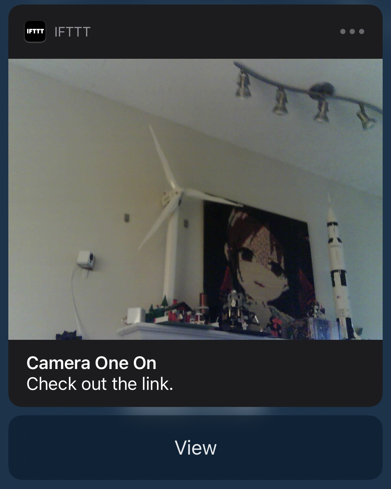
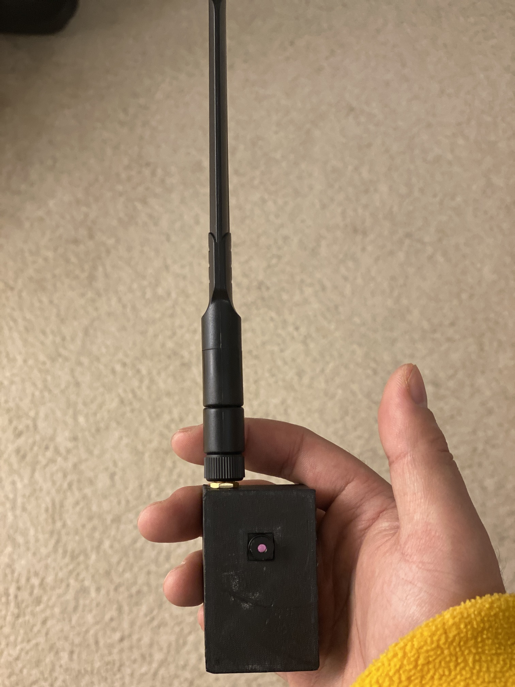

# ESP32-Cam Surveillance Camera with Alexa Support

The ESP32-Cam already has a feature-rich demo named [CameraWebServer](https://github.com/espressif/arduino-esp32/blob/master/libraries/ESP32/examples/Camera/CameraWebServer/CameraWebServer.ino).
This repo further adds several useful features to it. 
The core is the support of Alexa voice commands.
We used a [modified version](https://github.com/grapeot/esp32-alexa-wemo-emulator) of [this repo](https://github.com/igorantolic/esp32-alexa-wemo-emulator) to emulate a Wemo plug.
Eventually one can say "Alexa turn on camera one" and then receive a notice from IFTTT on the phone.
The rich notice contains a thumbnail to the captured photo, and tapping it leads to the ESP32-Cam server.

## How to Use

This repo is for information only as is.
Due to the limit of time, the author provides minimal support.
Please raise all questions in the issues, and I will try to answer that if time permits.

1. Clone the repo. Open the `CameraWebServer.ino`.
2. Download the code from [this repo](https://github.com/grapeot/esp32-alexa-wemo-emulator) as a zip file. And add this zip file to the library using Sketch -> Include Library -> Add .zip library in Arduino IDE.
3. Change related configs, especially the ssid, password, etc. You may need to read the code to understand what the config means.
4. In Alexa app, discover new devices (choose Wemo Plug). It should discover a new device with the name as set in `alexa_name`.
5. In IFTTT, set up an applet that if receive a WebHook as in the variable `ifttt_event` (e.g. `richnotice`), then send a rich notice to the phone. Put `value1` in the title, `value2` in the image, and `value3` in the link. You also need to get the WebHook key and fill it in `ifttt_key` in the code.
6. Compile and upload.

## Implementation Details

In order to achieve this, we made the following changes:

1. Integrate with the mDNS libaray to get rid of the hard coded IP.
2. Integrate with the [esp32-alexa-wemo-emulator](https://github.com/grapeot/esp32-alexa-wemo-emulator) libaray. Since Wemo PnP needs port 80, we have to move the camera server to 8080 and 8081. In addition to change the C code, this also involves changing the index.html, gzipping it, and putting it in `camera_index.h`.
3. Running Wemo daemon and AsyncWebServer didn't work out of the box, considering they both have separate message queues. Fortunately ESP32 has two cores, so we have to pin each task to a core, and let them run in parallel. This works, but the system gets more sensitive on the power supply. It seems to draw more current and heats more when both cores are used.
4. "Alexa turn on the camera" won't do anything if the device is already on. And memorizing the device's state is quite unpractical. So we added code to manually turn off the device immediately after it executes the turning on callback. This makes "alexa turn on the camera" always work. That's why we need a modified version of esp32-alexa-wemo-emulator.
5. In order to get good streaming speed, it's highly suggested to get an external antenna.

## Utilities

This repo also provides some useful utilities:

1. `case.scad` provides a 3D print design file for a small case with an optional external interface.
    
2. `auto_exposure.py` provides more extended auto exposure and time lapse support through python.
3. `zip.py` generates the index code in the `camera_index.h` from a gzipped html.